# Agentic Researcher RAG System

An advanced Retrieval-Augmented Generation (RAG) system that intelligently routes queries, retrieves relevant documents, performs web searches when needed, and generates high-quality answers with built-in quality control mechanisms.

## 🌟 Features

- **Intelligent Query Routing**: Automatically determines whether to use vector store retrieval or web search based on query content
- **Document Relevance Grading**: Evaluates retrieved documents for relevance and triggers web search for additional context when needed
- **Hallucination Detection**: Validates generated answers against source documents to ensure factual accuracy
- **Answer Quality Assessment**: Checks if generated responses adequately address the user's question
- **Interactive Workflow Visualization**: Real-time Mermaid diagram showing the current state of the RAG workflow
- **Comprehensive Testing**: Unit tests for all major components

## 🏗️ Architecture

The system is built using LangGraph and follows a state-based workflow with the following key components:

### Core Workflow Nodes

1. **Query Router** (`router.py`): Routes questions to either vector store or web search
2. **Document Retriever** (`retrieve.py`): Fetches relevant documents from Pinecone vector store
3. **Document Grader** (`grade_documents.py`): Evaluates document relevance to the query
4. **Web Search** (`web_search.py`): Performs web search using Tavily API when needed
5. **Answer Generator** (`generate.py`): Creates responses using retrieved context
6. **Quality Control**: Hallucination detection and answer relevance checking

### Workflow Logic

```mermaid
graph TD
    A[Start: Analyze Query] --> B{Route Decision}
    B -->|Vector Store| C[Retrieve Documents]
    B -->|Web Search| F[Web Search]
    C --> D[Grade Documents]
    D -->|Relevant| E[Generate Answer]
    D -->|Not Relevant| F
    F --> E
    E --> G{Quality Check}
    G -->|Good| H[Final Answer]
    G -->|Hallucination| E
    G -->|Poor Quality| F
```



## 🚀 Getting Started

### Prerequisites

- Python 3.8+
- OpenAI API key
- Pinecone API key
- Tavily API key (for web search)
- LangChain API key (optional, for tracing)

### Installation

1. Clone the repository:
```bash
git clone <repository-url>
cd AgenticResearcherRAGSystem
```

2. Create a virtual environment:
```bash
python -m venv venv
source venv/bin/activate  # On Windows: venv\Scripts\activate
```

3. Install dependencies:
```bash
pip install -r requirements.txt
```

4. Set up environment variables:
```bash
cp .env.example .env
```
Then edit the `.env` file and add your actual API keys. See `.env.example` for all required variables.

### Data Ingestion

Before running the system, you need to populate the vector store:

```bash
python ingestion.py
```

This will:
- Create a Pinecone index (if it doesn't exist)
- Load documents from predefined URLs (Lilian Weng's blog posts on agents, prompt engineering, and adversarial attacks)
- Split documents into chunks
- Generate embeddings using OpenAI
- Store vectors in Pinecone

### Running the System

```bash
python main.py
```

This will run a sample query and display the results including the question, generated answer, and source documents.

## 📁 Project Structure

```
AgenticResearcherRAGSystem/
├── graph/
│   ├── chains/
│   │   ├── generation.py          # Answer generation chain
│   │   ├── grade_generation_revelance.py  # Quality control chains
│   │   ├── retrieval_grader.py     # Document relevance grader
│   │   └── router.py               # Query routing logic
│   ├── nodes/
│   │   ├── generate.py             # Answer generation node
│   │   ├── grade_documents.py      # Document grading node
│   │   ├── retrieve.py             # Document retrieval node
│   │   └── web_search.py           # Web search node
│   ├── consts.py                   # Constants for node names
│   ├── graph.py                    # Main workflow definition
│   └── state.py                    # Graph state definition
├── templates/
│   └── index.html                  # Interactive workflow visualization
├── tests/
│   └── test_chains.py              # Unit tests
├── ingestion.py                    # Data ingestion script
├── main.py                         # Main execution script
├── graph.mmd                       # Generated Mermaid diagram
├── graph.png                       # Generated workflow visualization
└── .env                            # Environment variables
```

## 🧪 Testing

Run the test suite to verify all components are working correctly:

```bash
python -m pytest tests/ -v
```

The tests cover:
- Document retrieval and grading
- Answer generation
- Hallucination detection
- Query routing logic

## 🎯 Key Components

### State Management
The system uses a `GraphState` that tracks:
- `question`: User's input query
- `generation`: Generated answer
- `web_search`: Flag indicating if web search is needed
- `documents`: List of retrieved/searched documents

### Quality Control
- **Hallucination Grader**: Ensures answers are grounded in provided documents
- **Answer Grader**: Verifies that answers address the original question
- **Document Grader**: Filters out irrelevant retrieved documents

### Data Sources
The system can intelligently choose between:
- **Vector Store**: Pinecone database with pre-indexed documents
- **Web Search**: Real-time web search via Tavily API

## 🔧 Configuration

### Customizing Data Sources
Modify `ingestion.py` to add your own document URLs or change the chunking strategy.

### Adjusting Model Parameters
Update the LLM configurations in the chain files to use different models or adjust temperature settings.

### Workflow Customization
Modify `graph/graph.py` to add new nodes or change the decision logic.

## 📊 Workflow Visualization

The system includes an interactive HTML interface (`templates/index.html`) that:
- Displays the workflow as a Mermaid diagram
- Highlights active workflow steps in real-time
- Shows completed and pending steps
- Automatically resets when new queries are processed

## 🤝 Contributing

1. Fork the repository
2. Create a feature branch
3. Add tests for new functionality
4. Ensure all tests pass
5. Submit a pull request

## 📝 License

This project is licensed under the MIT License.

## 🙏 Acknowledgments

- Built with [LangGraph](https://github.com/langchain-ai/langgraph) for workflow orchestration
- Uses [LangChain](https://github.com/langchain-ai/langchain) for LLM integrations
- Vector storage powered by [Pinecone](https://www.pinecone.io/)
- Web search capabilities via [Tavily](https://tavily.com/)
- Workflow visualization using [Mermaid](https://mermaid.js.org/)

## 📈 Performance Notes

- The system automatically generates workflow diagrams (`graph.mmd` and `graph.png`) for documentation
- Supports real-time tracing via LangSmith when configured
- Optimized for both accuracy and efficiency with intelligent routing
- Includes comprehensive error handling and retry logic